  

> No plan survives first contact with `docker compose up`.

| Organisation | Link | Goal |
| :---: | --- | --- |
| 

 | [GitRegret](https://github.com/GitRegret) | Wall of shame of abandoned cool projects |
| 

 | [GitRegistry](https://github.com/GitRegistry) | Docker-composer private registry for infrastructure as code |
| 

 | [GitArchive](https://github.com/GitArchive) | Those that did not make it to wall of shame |

**Stack**

  
  
  
  
  
  
  
  
  
  
  
  

`local LLM` · `IoT` · `ML` · `tmux archaeology`

**Runtime dependencies:** coffee, cookies, chips, jamon serrano, gym, windsurf.
